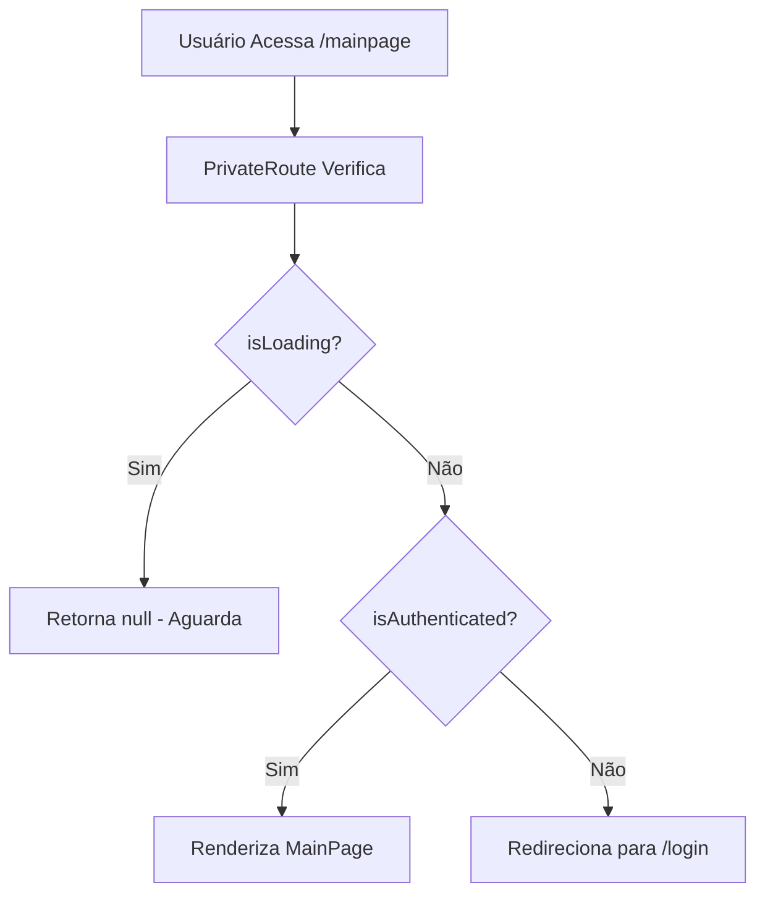

# Correção do Sistema de Autenticação

## 📋 Problemas Identificados

O sistema de autenticação apresentava os seguintes problemas críticos:

1. **Perda de autenticação ao recarregar a página**: Usuários logados eram redirecionados para `/login` após refresh
2. **Acesso negado com cookie válido**: Mesmo com cookies de sessão válidos, usuários eram impedidos de acessar `/mainpage`
3. **Loop de redirecionamento**: Navegação automática interferia no fluxo normal da aplicação
4. **Estado inconsistente**: O contexto de autenticação não mantinha o estado corretamente

## 🔧 Soluções Implementadas

### 1. Refatoração Completa do AuthContext

**Arquivo:** `src/contexts/AuthContext.jsx`

#### Problemas Corrigidos:
- ❌ Contexto fornecia apenas `isAuthenticated`
- ❌ Navegação automática para `/login` interferia no fluxo
- ❌ Falta de função centralizada de login
- ❌ Estado `isLoading` não estava disponível

#### Mudanças Implementadas:

```jsx
// ANTES - Contexto incompleto
<AuthContext.Provider value={{ isAuthenticated }}>

// DEPOIS - Contexto completo
<AuthContext.Provider value={{ 
    isAuthenticated, 
    isLoading, 
    login, 
    logout, 
    authProcess 
}}>
```

**Principais Adições:**

1. **Função `login` centralizada:**
```jsx
const login = async (email, senha) => {
    const dataUser = { "email": email, "senha": senha }
    try {
        await axios.post('/auth/login', dataUser, {
            withCredentials: true
        });
        setIsAuthenticated(true);
        return { success: true };
    } catch (error) {
        return { success: false, error: error.response?.data };
    }
}
```

2. **Remoção da navegação automática:**
```jsx
// ANTES - Redirecionamento automático
catch (error) {
    setIsAuthenticated(false)
    navigate('/login') // ❌ Interferia no fluxo
}

// DEPOIS - Sem redirecionamento
catch (error) {
    setIsAuthenticated(false)
    // ✅ Deixa o PrivateRoute decidir o redirecionamento
}
```

3. **Função `logout` para limpeza de estado:**
```jsx
const logout = async () => {
    try {
        await axios.post('/auth/logout', {}, {
            withCredentials: true
        });
        setIsAuthenticated(false);
        return { success: true };
    } catch (error) {
        console.log('Erro no logout:', error);
        // Mesmo com erro, limpa o estado local
        setIsAuthenticated(false);
        return { success: false, error: error.response?.data };
    }
}

### 2. Correção do PrivateRoute

**Arquivo:** `src/components/PrivateRoute.jsx`

#### Problema Corrigido:
- ❌ Import incorreto: `../contexts/useAuth` (arquivo inexistente)

#### Mudança:
```jsx
// ANTES
import { useAuth } from '../contexts/useAuth' // ❌ Arquivo não existia

// DEPOIS  
import { useAuth } from '../contexts/AuthContext' // ✅ Import correto
```

### 3. Refatoração da Página de Login

**Arquivo:** `src/pages/Login.jsx`

#### Problemas Corrigidos:
- ❌ Requisição direta ao backend (duplicação de lógica)
- ❌ Estado de autenticação não atualizado no contexto
- ❌ Variável `goTo` não utilizada

#### Mudanças Implementadas:

```jsx
// ANTES - Requisição direta
const sendLogin = async () => {
    try {
        await axios.post('/auth/login', dataUser, {
            withCredentials: true
        });
        navigate('/mainpage') // ❌ Estado não atualizado no contexto
    } catch (error) {
        errorMessage('Erro ao fazer login', error.response?.data)
    }
}

// DEPOIS - Uso da função do contexto
const handleLogin = async (e) => {
    e.preventDefault()
    
    if (!inputEmail || !inputPassword) {
        errorMessage('Por favor, preencha todos os campos');
        return;
    }

    const result = await login(inputEmail, inputPassword); // ✅ Função do contexto
    
    if (result.success) {
        navigate('/mainpage'); // ✅ Estado já atualizado
    } else {
        errorMessage('Erro ao fazer login', result.error);
    }
}
```

### 4. Configuração Global do Axios

**Arquivo:** `src/main.jsx`

#### Problema Corrigido:
- ❌ Cookies não eram enviados automaticamente em todas as requisições

#### Mudança:
```jsx
axios.defaults.baseURL = 'https://financepork.site/api';
axios.defaults.withCredentials = true; // ✅ Configuração global adicionada
```

### 5. Limpeza de Arquivos Conflitantes

#### Arquivos Removidos:
- `src/contexts/useAuth.js` - Duplicação desnecessária
- `src/contexts/AuthContextDefinition.js` - Não utilizado

**Motivo:** Estes arquivos causavam conflitos de import e duplicação de lógica.

## 🔄 Fluxo de Autenticação Corrigido

### 1. Inicialização da Aplicação
```mermaid
graph TD
    A[App Carrega] --> B[AuthProvider Inicializa]
    B --> C[authProcess() Executa]
    C --> D{Cookie Válido?}
    D -->|Sim| E[setIsAuthenticated(true)]
    D -->|Não| F[setIsAuthenticated(false)]
    E --> G[setIsLoading(false)]
    F --> G
    G --> H[Renderiza Componentes]
```

### 2. Proteção de Rotas


### 3. Processo de Login
```mermaid
graph TD
    A[Usuário Submete Login] --> B[login() do Contexto]
    B --> C[POST /auth/login]
    C --> D{Sucesso?}
    D -->|Sim| E[setIsAuthenticated(true)]
    D -->|Não| F[Retorna Erro]
    E --> G[navigate('/mainpage')]
    F --> H[Exibe Mensagem de Erro]
```

### 4. Processo de Logout
```mermaid
graph TD
    A[Usuário Clica em Sair] --> B[handleLogout() Executa]
    B --> C[logout() do Contexto]
    C --> D[POST /auth/logout]
    D --> E{Sucesso?}
    E -->|Sim| F[setIsAuthenticated(false)]
    E -->|Não| G[setIsAuthenticated(false) - Força Limpeza]
    F --> H[navigate('/')]
    G --> H
    H --> I[Usuário na Landing Page]
```

## ✅ Resultados Esperados

Após as correções implementadas:

1. **✅ Persistência de Sessão**: Usuários permanecem logados após recarregar a página
2. **✅ Acesso Direto**: URLs como `/mainpage` funcionam corretamente com cookies válidos
3. **✅ Estado Consistente**: O contexto de autenticação mantém estado correto em toda a aplicação
4. **✅ Fluxo Limpo**: Sem loops de redirecionamento ou navegação indesejada
5. **✅ Código Organizado**: Lógica de autenticação centralizada no contexto
6. **✅ Logout Funcional**: Botão "Sair" limpa sessão no servidor e redireciona corretamente
7. **✅ Imagens Carregando**: Todas as imagens (logos, ícones) carregam corretamente

## 🧪 Como Testar

1. **Teste de Login:**
   - Faça login com credenciais válidas
   - Verifique se é redirecionado para `/mainpage`

2. **Teste de Persistência:**
   - Após login, recarregue a página
   - Verifique se permanece logado

3. **Teste de Acesso Direto:**
   - Com sessão ativa, acesse diretamente `/mainpage`
   - Verifique se não é redirecionado para login

4. **Teste de Proteção:**
   - Sem estar logado, tente acessar `/mainpage`
   - Verifique se é redirecionado para `/login`

5. **Teste de Logout:**
   - Estando logado, clique no botão "Sair"
   - Verifique se é redirecionado para a landing page
   - Tente acessar `/mainpage` diretamente
   - Verifique se é redirecionado para `/login`

6. **Teste de Imagens:**
   - Verifique se o logo aparece no header da MainPage
   - Verifique se os ícones de redes sociais aparecem nos cards
   - Verifique se o logo aparece no navbar e footer
   - Confirme que não há imagens quebradas (ícone de "X")

## 📝 Notas Técnicas

- **Cookies**: A aplicação depende de cookies HTTP para manter a sessão
- **CORS**: Configuração `withCredentials: true` é essencial para envio de cookies
- **Loading State**: O estado `isLoading` previne renderização prematura durante verificação de autenticação
- **Error Handling**: Erros de autenticação são tratados graciosamente sem quebrar a aplicação

## �️ Correção das Referências de Imagens

### Problema Identificado:
Após as correções de autenticação, as imagens não estavam carregando corretamente devido a referências incorretas.

### Arquivos Corrigidos:
- `src/pages/MainPage.jsx`
- `src/components/CardApresentacaoDir.jsx`
- `src/components/CardApresentacaoEsq.jsx`
- `src/components/Footer.jsx`
- `src/components/Navbar.jsx`

### Mudança Implementada:

```jsx
// ❌ ANTES - Referência relativa (não funciona no Vite)


// ✅ DEPOIS - Referência absoluta (funciona)


```

### Explicação Técnica:
- **Vite/React**: Arquivos na pasta `public` são servidos na raiz do servidor
- **Referências Absolutas**: Devem começar com `/` para apontar para a raiz
- **Referências Relativas**: O `./` indica caminho relativo ao componente, não à pasta `public`

### Imagens Corrigidas:
- ✅ Logo principal da MainPage (`iconBranco.png`)
- ✅ Ícones de redes sociais (`instagram.png`, `github.png`, `linkedin.png`)
- ✅ Logo do footer e navbar (`icon.png`)
- ✅ Imagens de background já estavam corretas (usando `/`)

## �🔮 Melhorias Futuras Sugeridas

1. **Token Refresh**: Implementar renovação automática de tokens
2. ~~**Logout Endpoint**: Adicionar chamada para endpoint de logout no servidor~~ ✅ **IMPLEMENTADO**
3. **Loading Component**: Criar componente visual para estado de carregamento
4. **Session Timeout**: Implementar timeout automático de sessão
5. **Remember Me**: Adicionar opção de "lembrar-me" para sessões mais longas
6. **Confirmação de Logout**: Adicionar modal de confirmação antes do logout
7. **Logout em Múltiplas Abas**: Sincronizar logout entre abas do navegador